<div align="center">


# NuBook 极简记账本

基于 Clean Architecture 与 MVVM 架构开发的现代化极简 Android 记账应用

---
</div>

<div align="center">
  
  中文| [English](README.md) | [日本語](README.ja.md)
  
</div>

## APP 直接下载体验

<table align="center">
  <tr>
    <td align="center">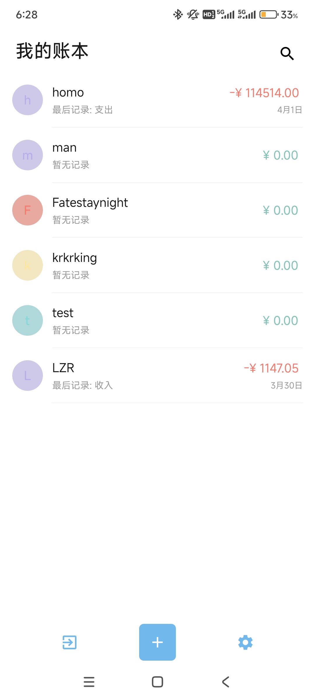<br>主页页面</td>
    <td align="center">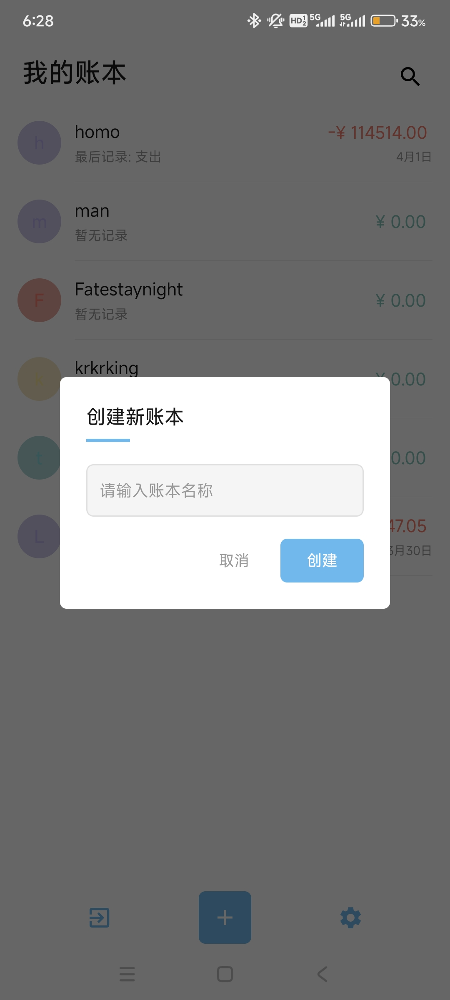<br>账本创建</td>
    <td align="center">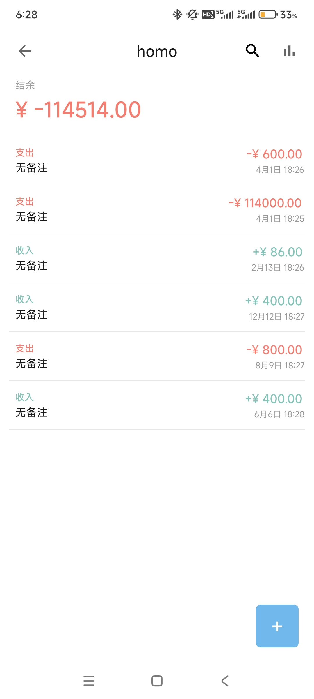<br>账本页面</td>
  </tr>
</table>

你可以直接在当前 GitHub 仓库右侧的 **[Releases]** 面板中下载最新编译发布的 `NuBook_v2.1.0_universal.apk` 安装包。将 APK 下载到手机后可直接免配置安装体验。

## 为什么选择 NuBook？(对比市面主流记账应用)

市面上的记账软件往往越来越臃肿，充斥着广告、社交圈子以及强制的云同步限制。对于仅仅只想记录个人理财流水的人来说，NuBook 在四个核心维度上做到了极致的减法与底层革命：

### 1. 绝对的数据主权与多层容错导入

<table align="center">
  <tr>
    <td align="center">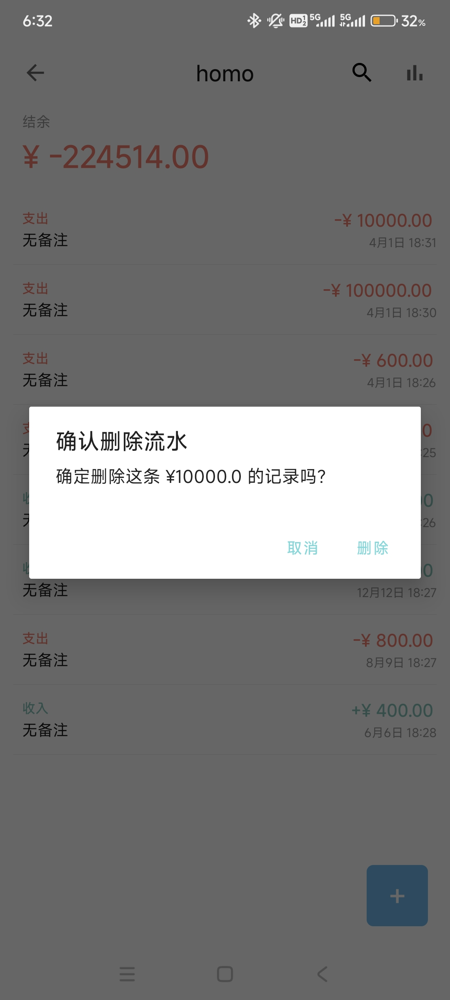<br>账目防误删</td>
    <td align="center">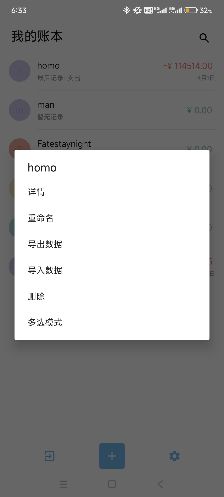<br>导入导出支持</td>
    <td align="center">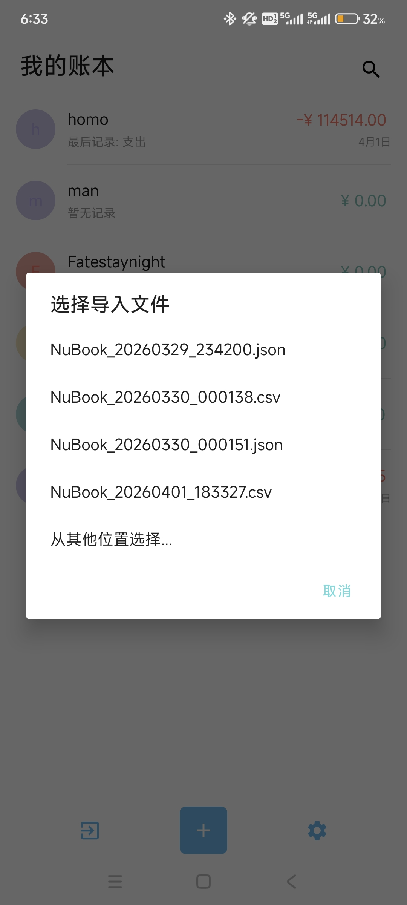<br>直接寻找可导入文件</td>
  </tr>
</table>

*   **市面竞品痛点**：数据被绑架。许多应用将账本加密在应用沙盒内，导出为难以解析的特殊格式文件，甚至将“导出 Excel/CSV”包装为必须要内购付费解锁的 VIP 功能。
*   **NuBook 的颠覆**：数据 100% 自由化流转。只需一点，你可以瞬间生成 JSON 抽象树字典、JSONL 逐行或人类可读的标准 CSV 表格，并直接保存在系统公开可见的 `Documents/NuBook` 目录下。最强大的是我们在导入模块植入了**三阶智能探测系统**——情景举例：你完全可以在电脑把导出的 CSV 随手乱改字段、或者用记事本混合 JSON 塞在一块传回手机，系统引擎会自动屏蔽损毁的烂行，强行提取出规范数据写入 Room 数据库进行还原操作。


### 2. 即时代数解析，告别弹窗计算器

<table align="center">
  <tr>
    <td align="center">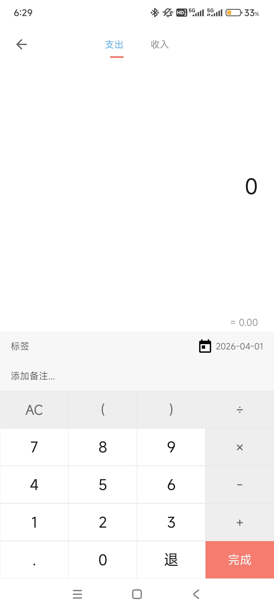<br>输入账目</td>
    <td align="center">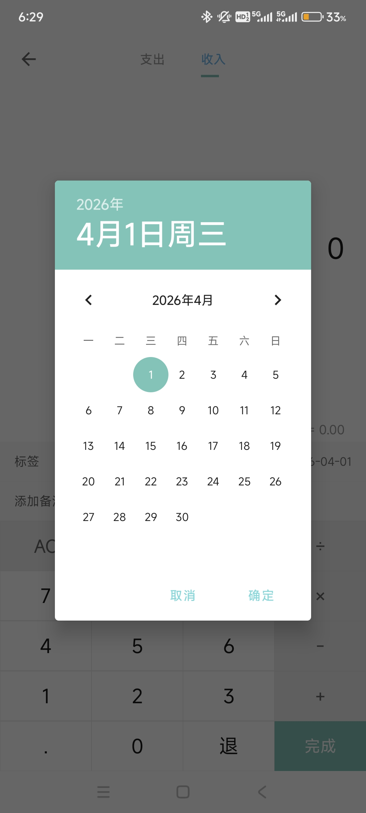<br>账目时间选择</td>
    <td align="center">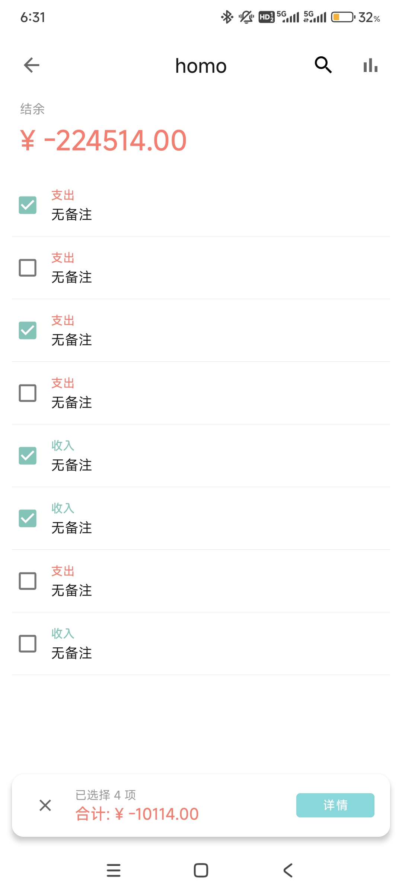<br>任意账目计算</td>
  </tr>
</table>

*   **市面竞品痛点**：记下“买菜38元加两瓶水4元还要减去超市退的2元”，必须单独弹出一个小键盘计算器算半天，再把几十位的结果强行搬移或者点击确认输入。
*   **NuBook 的颠覆**：记账输入完全不局限于冰冷的数字。底层的输入层桥接了强大的 `mXparser` 库。情景举例：当你的脑海里呈现上述金额片段时，你只需要在输入框狂放地敲入 `38+(2*2)-2`，系统底层会实时剥离将其转为抽象语法树 (AST) 解析出浮点结果落盘。体验属于极客的高级数字录入爽感。

### 3. 深度的像素级主题自适应，告别模板化

<table align="center">
  <tr>
    <td align="center">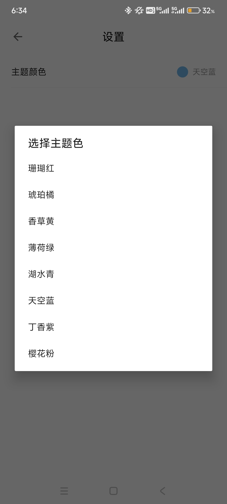<br>多种色彩选择</td>
    <td align="center">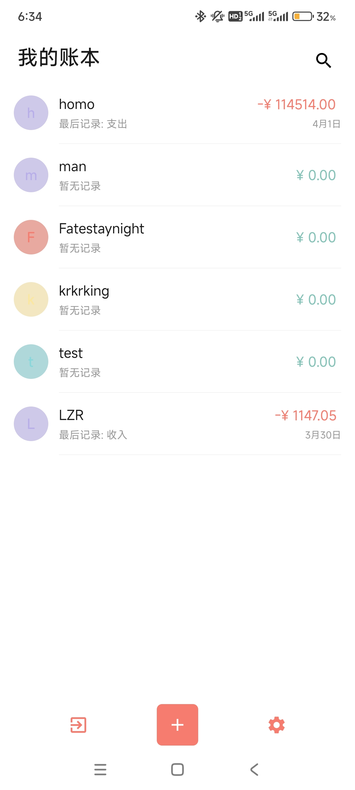<br>颜色改变示例</td>
    <td align="center">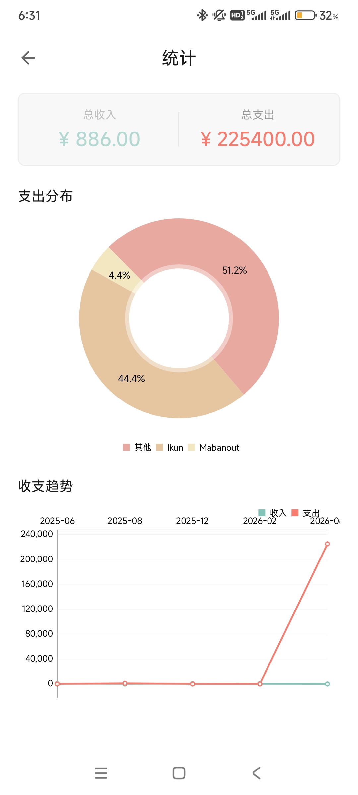<br>彩色统计图表</td>
  </tr>
</table>

*   **市面竞品痛点**：界面提供干瘪的“白天模式/黑夜模式”，或者必须花钱买皮肤。即便换了皮肤也存在大量的未适配边角和厚重的立体阴影。
*   **NuBook 的颠覆**：采用极致扁平化哲学（全应用封杀卡片 Z 轴阴影，全局 `elevation="0dp"`），再辅以全局底层渗透的 `ColorEngine` 引擎。你选定一种颜色为主轴调子，系统会通过底层生命周期劫持，让底部系统横栏的三个图标、账单列表里每一条记录左侧的柔和遮罩带、甚至于统计图表上的圆环配比占比扇形，统统像素级地重装为该主色调。让你拥有无缝融合的沉浸美学归属。

### 4. 数据防火墙：真空运行环境
*   **市面竞品痛点**：注册即需要填手机号，后台常驻各种唤醒服务强行推销理财产品课，甚至读取你的位置、相册信息。
*   **NuBook 的颠覆**：绝对的 0 打扰与真空运行机制。我们不仅完全抛弃了后台常驻系统与闹钟唤醒（AlarmManager），更是在应用的底层配置表 `AndroidManifest.xml` 中没有申请哪怕一行联网（INTERNET）权限。没有了联网底座，NuBook 只能、且只会安分地与本地构建的 SQLite (Room) 进行交接。没有社交，没有开屏，这里仅仅只是记录数字。

## 技术栈与架构 (Tech Stack & Architecture)

本项目遵循 Android 官方推荐最新的开发架构规范：
- 开发语言：Kotlin 1.9+
- 异步框架：Kotlin Coroutines + Flow
- 生命周期：Jetpack Lifecycle, ViewModel, LiveData
- 数据持久化：Jetpack Room
- UI 组件库：Material Components for Android (轻度定制版)
- 图表绘制：MPAndroidChart (去阴影柔和色填充化)
- 依赖管理 / 编译引擎：Gradle (KTS) / AGP 8.2.2

## 项目结构指南

```text
com.nubook/
├── NuBookApplication.kt  # 全局应用入口声明
├── data/
│   ├── export/       # 三阶智能数据导入与多协议导出解析引擎
│   └── local/        # Room Database，Entity 表结构实体与 Dao 检索接口
├── domain/           
│   └── usecase/      # 干净的业务层处理单元（如核心计算、筛选、统计过滤等用例）
└── ui/
    ├── base/         # 深层 BaseActivity (提供主题级重载引擎)
    ├── home/         # 首页聚合面板与多账单瀑布流
    ├── input/        # 记账流录入界面与 mXparser 数学算法桥接
    ├── ledger/       # 单个特定账本的具体详细流水历史
    ├── search/       # 基于流的全局关键词实时过滤
    ├── settings/     # 颜色引擎切换主入口
    ├── statistics/   # MPAndroidChart 图表呈现逻辑
    └── theme/        # ColorEngine 核心自主渲染器
```

## 编译与运行 (Build & Run)

环境要求：JDK 17+, Android Studio Iguana / Jellyfish (或以上版本)。

1. 将本仓库克隆、下载 ZIP 或者拉取至本地。
2. 使用 Android Studio 打开该项目。
3. 如果未配置 Android SDK，会在 `local.properties` 文件生成所需配置。
4. 等待 Gradle Sync 完成解析依赖库后，点击 Run 'app' （绿三角）即可编译并在真机或模拟器中运行 (对应 Android API >= 24)。

## 证书与开源协议

本项目开源，遵守 MIT License。你可以自由使用和探索本项目的源码进行进一步开发和二次修改。
